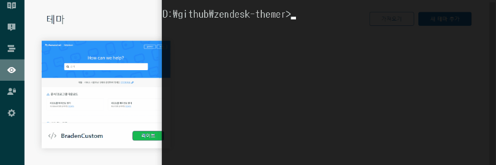

# zendesk-themer
CLI for zendesk hc theme deploy

<p align="center">
    
</p>

⚠️ This package is made using a [puppeteer](https://github.com/GoogleChrome/puppeteer). **It's very easy to break**.

## Install
```sh
npm i -g zendesk-themer
```

## Usage
### themer up \<src> [options]
```sh
$ themer up --help

  Description
    Upload a live theme.

  Usage
    $ themer up <src> [options]

  Options
    -p, --persist     No remove a old theme.
    -m, --multiple    Upload multiple themes.
    -h, --help        Displays this message

  Examples
    $ themer themer up themes/test-theme/
    $ themer themer up themer.json
    $ themer themer up themes/**/themer.json --multiple
```

### themer down [options]
```sh
$ themer down --help

  Description
    Download live theme.

  Usage
    $ themer down [options]

  Options
    -c, --config    Using config file.
    -h, --help      Displays this message

  Examples
    $ themer themer down
    $ themer themer down --config themer.json
```

## themer.json
```json
{
  "domain": "https://test.zendesk.com/",
  "email": "test@rsupport.com",
  "password": "test1234",
  "target": "./",
  "theme_path": "../common_theme/"
}
```

- `domain` - Required. Zendesk help center domain.
- `email` - Required. Email for zendesk login.
- `password` - Required. Password for zendesk login.
- `target` - Required. Theme path to upload.
- `theme_path` - Optional. If it exists, copy files except the "settings/" directory.

## License
MIT
